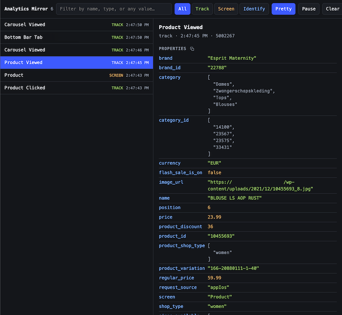

# Analytics Mirror

See the analytics events your app sends, the moment it sends them.

Point your app's analytics SDK (Hightouch) at a small local server and every event shows up
in a browser tab instantly — full properties, traits and envelope — instead of
waiting on a vendor dashboard that batches, samples, and lags by minutes.



## How it works

```
your app  ── POST /event ──►  local server  ── SSE /stream ──►  browser viewer (ring buffer, last 2000 events)
```

Three moving parts, no build step, one dependency:

- **The server** ([log-viewer/index.js](log-viewer/index.js)) accepts events on
  `POST /event`, keeps the last 2000 in memory, and rebroadcasts them over
  Server-Sent Events.
- **The viewer** ([log-viewer/public/index.html](log-viewer/public/index.html))
  is a single static HTML file. No bundler, no framework.
- **A client plugin** forwards events from your app. An iOS one for the
  Hightouch SDK ships in [`client plugin/`](client%20plugin/plugin.swift).

Nothing is persisted. Stop the server and the events are gone.

## ⚠️ Read this before you run it

**This tool rebroadcasts your analytics payloads verbatim, over unencrypted
HTTP.** Those payloads routinely carry email addresses, user IDs, session
identifiers and behavioural history. Two rules follow:

1. **Never ship the client plugin in a production build.** The supplied Swift
   plugin is wrapped in `#if DEBUG || STAGING` for exactly this reason. Keep it
   that way.
2. **The server binds to loopback by default.** Opening it to your LAN with
   `HOST=0.0.0.0` means anyone on that network can read your event stream and
   clear your buffer — there is no authentication. Only do it on a network you
   trust, and only while you need it.

## Quick start

Requires Node 18 or newer.

```bash
cd log-viewer && npm install && npm start
```

Open <http://localhost:9977>. Send it something:

```bash
curl -X POST localhost:9977/event -H 'content-type: application/json' \
  -d '{"type":"track","event":"Hello","properties":{"works":true}}'
```

### Configuration

| Variable | Default | Notes |
|---|---|---|
| `PORT` | `9977` | |
| `HOST` | `127.0.0.1` | `0.0.0.0` to accept events from a physical device. See the warning above. |

An iOS **Simulator** shares your Mac's loopback interface, so it works against
the default `127.0.0.1` with no extra setup. Only a **physical device** needs
`HOST=0.0.0.0`.

## Using the viewer

| | |
|---|---|
| Filter by type | `All` / `Track` / `Screen` / `Identify` |
| Search | Matches event name, type, or any value in the payload |
| Move between events | `↑` / `↓` |
| `Pretty` | Indent nested JSON values (on by default); off gives one-line minified |
| `Pause` | Stop redrawing. Events still buffer, and appear when you resume |
| `Clear` | Empty the server's buffer |

Copy buttons sit beside each section heading (copies the whole section as JSON),
at the right of every row (copies that one value), and next to **Full envelope**
(copies the entire event). Values copy exactly as displayed, so the `Pretty`
toggle governs the clipboard too.

## iOS integration (Hightouch)

Add [`client plugin/plugin.swift`](client%20plugin/plugin.swift) to your target
and register it:

```swift
#if DEBUG || STAGING
analytics.add(plugin: AnalyticsMirrorPlugin())
#endif
```

The `#if` around the call site is **required**, not decoration: the plugin type
does not exist in a Release build, so an unguarded call fails to compile.

If you use the `STAGING` half of that condition, add `STAGING` to
`SWIFT_ACTIVE_COMPILATION_CONDITIONS` for that configuration. It is not a
built-in flag — without it the guard quietly means DEBUG-only.

### Running against a physical device

Everything above works on the Simulator as-is. A real device talks to your Mac
over the LAN, which needs three more things:

**1.** Start the server with `HOST=0.0.0.0`.

**2.** Point the plugin at your Mac's LAN address:

```swift
AnalyticsMirrorSettings.host = "192.168.1.42:9977"
```

**3.** Add both keys to your **debug** `Info.plist`. iOS blocks cleartext HTTP
and gates local-network access; loopback is exempt from both, which is why the
Simulator needs neither and a device fails silently without them:

```xml
<key>NSAppTransportSecurity</key>
<dict>
    <key>NSAllowsLocalNetworking</key>
    <true/>
</dict>
<key>NSLocalNetworkUsageDescription</key>
<string>Mirrors analytics events to a local viewer during development.</string>
```

## HTTP API

Any client that can POST JSON works — the iOS plugin is a convenience, not a
requirement.

| | | |
|---|---|---|
| `POST` | `/event` | Body is the event JSON. Max 2 MB. Returns `204`. |
| `GET` | `/stream` | SSE. First message is `{"replay":[...]}` with the buffer, then one `{"at":…,"payload":…}` per event. |
| `DELETE` | `/events` | Clears the buffer. Returns `204`. |

`at` is the server's arrival timestamp. Under a burst, events can arrive out of
the order the app emitted them — if your payloads carry their own timestamp,
trust that one.

## License

MIT — see [LICENSE](LICENSE).
